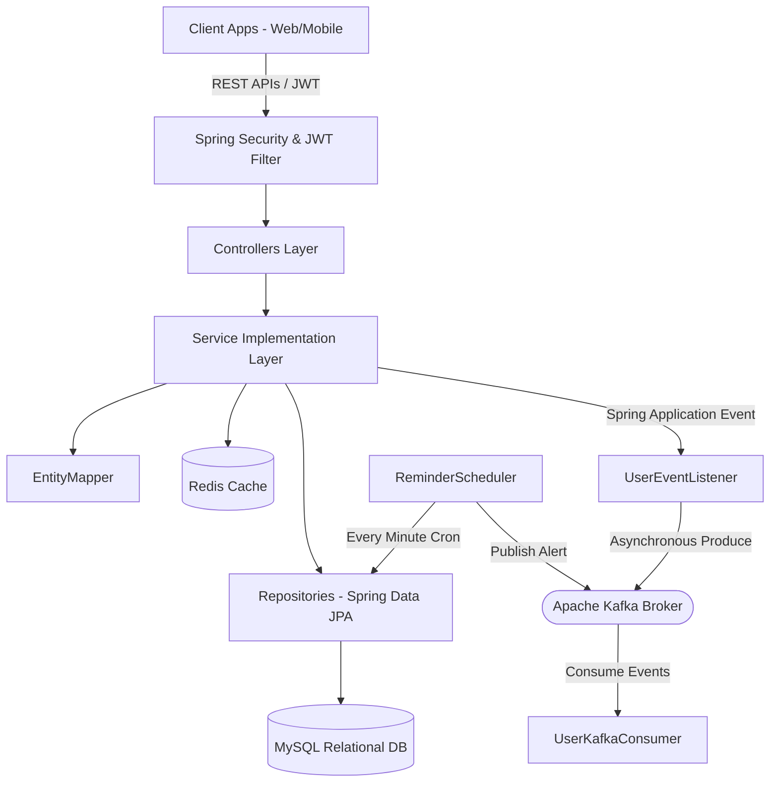
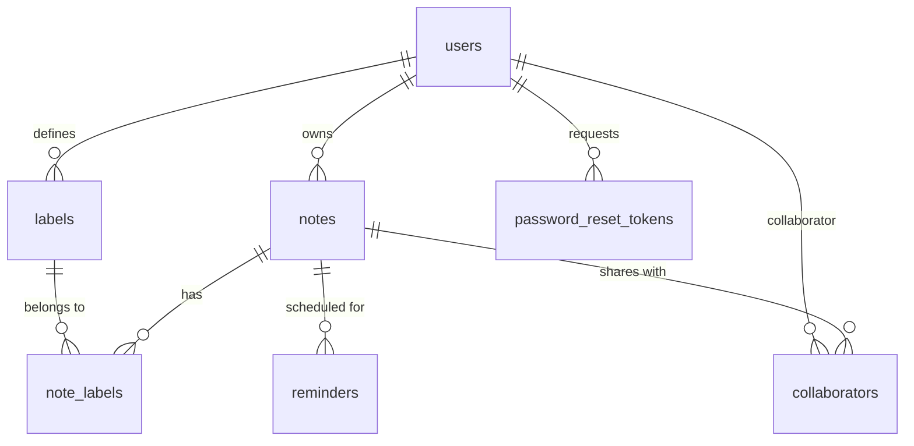

# Fundoo Notes Backend - Onboarding & Architecture Guide

Welcome to the **Fundoo Notes Backend** development team! This onboarding guide is designed to help new backend developers understand the application architecture, system design, data schemas, messaging infrastructure, caching strategies, and setup instructions.

---

## 1. System Architecture Overview

The backend is built as a cloud-ready, enterprise-grade Spring Boot micro-service using standard layered/MVC architecture pattern with cross-cutting components:



### Key Architectural Layers
1. **Controller Layer:** Exposes endpoints defined in [ApiConstants](file:///d:/BridgeLabz/MagicSoftware/fundoo/src/main/java/com/bridgelabz/fundoo/constant/ApiConstants.java). Standardizes return types using `ResponseEntity<APIResponse<T>>`.
2. **Service Layer:** Houses core business logic, handles transactions, caches heavy read queries via Redis annotations, and fires Spring internal events.
3. **Repository Layer:** Database abstraction interface using Spring Data JPA. Focuses on preventing N+1 queries using optimized `JOIN FETCH` statements.
4. **Messaging & Schedulers:** Decouples heavy or time-delayed logic (e.g., email dispatch, reminder alerts) into asynchronous event emitters and message queues.

---

## 2. Database Schema Design (MySQL)

We utilize Hibernate's automatic schema update (`ddl-auto=update`) in development. The tables are configured with specific indexes, unique keys, and optimistic locking to ensure high-performance concurrent database transactions.



### Table Specifications

#### A. `users` Table
* **Unique Constraints:** `uk_users_email` (unique index on `email`)
* **Indexes:** `idx_users_email` on column `email`
* **Optimistic Locking:** Inherits `version` from `BaseEntity`
* **Columns:**
  - `id` (BIGINT, Primary Key, Auto-increment)
  - `first_name` (VARCHAR(100), NOT NULL)
  - `last_name` (VARCHAR(100))
  - `email` (VARCHAR(255), NOT NULL, UNIQUE)
  - `phone_number` (VARCHAR(20))
  - `password` (VARCHAR(255), NOT NULL) - Bcrypt encoded
  - `role` (VARCHAR(20), NOT NULL) - values: `ROLE_USER`, `ROLE_ADMIN`
  - `active` (BOOLEAN, default true)
  - `verified` (BOOLEAN, default false)
  - `deleted` (BOOLEAN, default false)
  - `last_login_at` (DATETIME)
  - `deleted_at` (DATETIME)
  - `created_at`, `updated_at`, `version`

#### B. `notes` Table
* **Foreign Keys:** `owner_id` references `users(id)`
* **Indexes:** 
  - `idx_note_user` on `owner_id` (accelerates user dashboard queries)
  - `idx_note_title` on `title` (accelerates query search operations)
* **Columns:**
  - `id` (BIGINT, Primary Key, Auto-increment)
  - `title` (VARCHAR(500), NOT NULL)
  - `description` (VARCHAR(5000))
  - `color` (VARCHAR(30), default `#ffffff`)
  - `pinned` (BOOLEAN, default false)
  - `archived` (BOOLEAN, default false)
  - `trashed` (BOOLEAN, default false)
  - `deleted` (BOOLEAN, default false)
  - `deleted_at` (DATETIME)
  - `owner_id` (BIGINT, NOT NULL)

#### C. `labels` Table
* **Foreign Keys:** `user_id` references `users(id)`
* **Indexes:** `idx_label_user` on `user_id`
* **Columns:**
  - `id` (BIGINT, Primary Key, Auto-increment)
  - `name` (VARCHAR(100), NOT NULL)
  - `user_id` (BIGINT, NOT NULL)

#### D. `note_labels` Join Table (Many-to-Many)
* **Columns:**
  - `note_id` (BIGINT, Foreign Key references `notes(id)`)
  - `label_id` (BIGINT, Foreign Key references `labels(id)`)

#### E. `collaborators` Table
* **Unique Constraints:** `uk_note_user` on `(note_id, user_id)` (prevents duplicating same collaborator on a single note)
* **Columns:**
  - `id` (BIGINT, Primary Key, Auto-increment)
  - `note_id` (BIGINT, NOT NULL, Foreign Key)
  - `user_id` (BIGINT, NOT NULL, Foreign Key)
  - `role` (VARCHAR(30)) - values: `OWNER`, `EDITOR`, `VIEWER`, `ADMIN`

#### F. `reminders` Table
* **Columns:**
  - `id` (BIGINT, Primary Key, Auto-increment)
  - `remind_at` (DATETIME, NOT NULL)
  - `status` (VARCHAR(30)) - values: `PENDING`, `COMPLETED`, `SNOOZED`, `CANCELLED`
  - `notified` (BOOLEAN, default false)
  - `note_id` (BIGINT, NOT NULL, Foreign Key)

---

## 3. Caching Architecture (Redis)

To maximize throughput and limit heavy MySQL read operations, Redis is integrated at the service layer level.

* **Cache TTL:** 1 Hour (Default)
* **Serialization Policy:** Keys are serialized as `StringRedisSerializer`, Values are serialized as `GenericJackson2JsonRedisSerializer` (JSON format).

### Cache Integration Strategy
1. **User Cache (`"users"`)**:
   - Cache key format: `users::<userId>`
   - Evicted or updated on user updates (`@CacheEvict` or `@CachePut`).
2. **Notes Cache (`"notes"`)**:
   - Cache key format: `notes::<noteId>`
   - Cache write: Triggered on fetching a note by ID.
   - Cache eviction: Automatically invalidated whenever a note is modified, deleted, color is patched, or label link status changes.

---

## 4. Message Broker Architecture (Apache Kafka)

The application publishes domain event records to Kafka topics. This decoupling allows consumer systems (like external mail servers, push notification microservices, audit log engines) to process jobs asynchronously.

### Topics Configuration
The following topics are declared automatically in [KafkaConfig](file:///d:/BridgeLabz/MagicSoftware/fundoo/src/main/java/com/bridgelabz/fundoo/config/KafkaConfig.java):

| Topic Name | Partitions | Replicas | Producer | Trigger Triggered |
| :--- | :---: | :---: | :--- | :--- |
| **`user-events`** | 3 | 1 | `UserEventListener` | User registration or forgot-password token request |
| **`reminder-alerts`**| 3 | 1 | `ReminderScheduler`| Chronological reminder job becomes due |
| **`audit-logs`** | 3 | 1 | `UserEventListener` | General user and system state updates |

### Event Lifecycle Example
1. A user triggers `/api/v1/users/register`.
2. The user is saved to the database, and a Spring `ApplicationEvent` is published internally.
3. The asynchronous `UserEventListener` captures the event.
4. It formats a JSON payload and calls `UserEventProducer.sendEvent("user-events", userId, payload)`.
5. The local `UserKafkaConsumer` catches the message and logs it (acts as a consumer placeholder).

---

## 5. Security & Authentication Setup

* **Framework:** Spring Security 6.x
* **Session Policy:** `SessionCreationPolicy.STATELESS` (stateless REST APIs)
* **Filter Chain:** `JwtAuthenticationFilter` is added before `UsernamePasswordAuthenticationFilter`.
* **Flow:**
  1. Extraction: Token is extracted from the `Authorization: Bearer <token>` header.
  2. Verification: Verified against HMAC-256 secret key.
  3. Authentication: Resolves user details from database, registers `UsernamePasswordAuthenticationToken` in Spring's security context.

---

## 6. Local Development Onboarding Setup

### Prerequisites
* **JDK:** Version 21
* **Build System:** Apache Maven 3.x
* **Databases/Brokers:** MySQL Server, Redis Server, Apache Kafka

### Setup Steps

#### Step 1: Create Database
Connect to your local MySQL instance and run:
```sql
CREATE DATABASE fundoo_db;
```

#### Step 2: Configure Environment Properties
Create or edit `src/main/resources/application-dev.properties` to match your local services:
```properties
# Database connection settings
spring.datasource.url=jdbc:mysql://localhost:3306/fundoo_db
spring.datasource.username=your_mysql_username
spring.datasource.password=your_mysql_password

# Kafka broker connection
spring.kafka.bootstrap-servers=localhost:9092

# Redis connection
spring.data.redis.host=localhost:6379
spring.data.redis.port=6379
```

#### Step 3: Run Build & Boot
Run the following commands in the workspace root:
```powershell
# Clean build and compile
mvn clean compile

# Boot the backend application
mvn spring-boot:run
```

Once booted, the server starts on port `8080`.
* **Swagger Documentation URL:** `http://localhost:8080/swagger-ui/index.html`
* **API base path:** `http://localhost:8080/api/v1`

---

## 7. Testing Setup

We use JUnit 5 and Mockito for unit testing. Automated tests use an in-memory H2 database, bypassing active Kafka and Redis brokers. This allows unit tests to compile and pass even if local services are offline.

```powershell
# Run the test suites
mvn clean test
```
